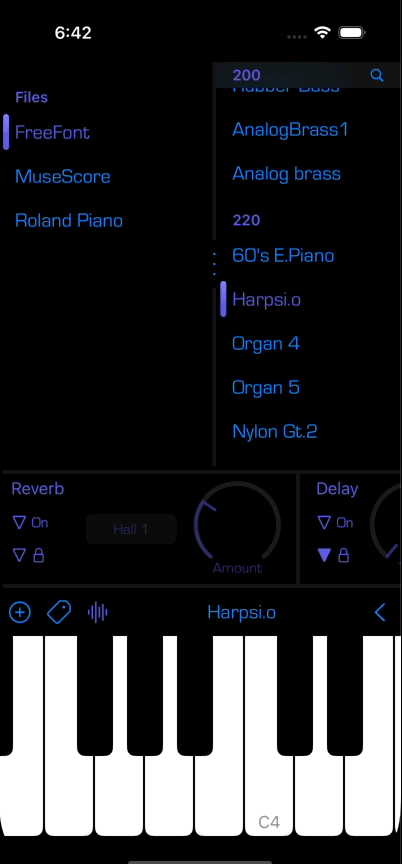

[![CI][status]][ci]
[![COV][cov]][ci]
[![License: MIT][mit]][license]

# SoundFonts+

This is the SwiftUI version of my [SoundFonts][0] app.

Main dependencies:

* [Composable Architecture (TCA)][1] -- opinionated approach to structuring an iOS app as composable features that
  provide for well-structured, understandable, testable, event flows and data transformations to drive SwiftUI views.
* [sharing-grdb][2] -- provides a shared-data capability by combining Point-Free's [Sharing][3] and
  [StructuredQueries][4] libraries with the robust [GRDB][5] toolkit for SQLite
* [AUv3Controls][6] -- custom SwiftUI controls (a circular knob and a toggle) that supports easy integration with AUv3
  AUParameter entities (built using the [TCA][1] library as well)
* [SF2Lib][7] -- an audio synthesizer in Objective-C++ that reads sound font (SF2) files. It is used here to read the
  files and provide the presets info and meta data that goes into the SQLite tables.
* [brh-splitview][9] -- custom TCA-based SwiftUI view/feature that adjusts the width or height between two children.



# Status

The app is getting close to feature-parity with the the original UIKit version:

* generates audio using both onscreen keyboard as well as from MIDI devices
* reverb and delay effects
* imports SF2 files
* supports cloning of presets (aka "favorites")
* tagging fonts

Nearly all app data resides in SQLite database, though there are some `UserDefaults` settings and a file-based `@Shared`
struct that holds:

* selected SoundFont ID
* active SoundFont ID
* active preset ID
* active tag ID

When any of these values change, the various views update as would be expected:

* active tag ID changes --> list of SoundFont entries adapts
* selected SoundFont ID changes --> list of preset entries updates
* active preset ID changes:
    * audio effects update if preset has custom config
    * keyboard shifts to a configured value
    * SF2 engine loads preset (TBD)
    * MIDI mapping updated if preset has custom config (TBD)

The app also relies on in-memory `@Shared` values to simplify the logic and API.

## Keyboard

The keyboard is one SwiftUI view that leverages the latest SwiftUI features to be able to draw the keys and track
multiple touches that the same time. It too is a [TCA][1] feature but for performance reasons, the amount of info kept
in the state is minimal. The keyboad can be set to remain in place during a drag, or to slide as a touch moves. This all
replicates what currently exists in the original [SoundFonts][0] UIKit version. 

## Effects Controls

The original [SoundFonts] app provides a UI for two effects -- reverb and delay -- provided by Apple on all iOS devices.
This has been replicated in SwiftUI using my [AUv3Controls][6] package. The controls are also built using [TCA][1]
though the knob control has a debounce effect to reduce the amount of updates sent through its reducer.

## Dividers

There is a vertical divider between the list of sound font files and the list of presets, and a horizontal divider
separating the font list and the tags (usually hidden until the "tags" button is tapped in the info bar). These dividers
are custom SwiftUI views that adorn a custom view from the [brh-splitview][9] package that manages the width/height of
its children. Double-tapping on the horizontal divider will close the tags view.

## List Views

There are three SwiftUI list views on the home view:

* list of sound font names
* list of tags
* list of presets

Only the tags list uses a [@FetchAll][tags] macro in its feature state since it does not depend on any other state to
determine what to show. The list of sound fonts relies on the contents of the [@Shared(.activeState)'s
activeTagId][activeTagId] value to determine what fonts to show. When this changes, an action is sent back to the
reducer to generate a new [@FetchAll][sf2] query and then start listening to *it* for changes that drive the SwiftUI
view updates:

```swift
private func monitorFetchAll(_ state: inout State) -> Effect<Action> {
  return .run { send in
    @FetchAll(SoundFontInfo.taggedQuery) var soundFontInfos
    try await $soundFontInfos.load(SoundFontInfo.taggedQuery)
    for try await update in $soundFontInfos.publisher.values {
      await send(.soundFontInfosChanged(update))
    }
  }.cancellable(id: CancelId.fetchAll, cancelInFlight: true)
}
```

There may be a better way to do this, but it works without any perceptible delays.

### Presets List

The list of presets is the most complicated view due to the fact that the preset entries usually live in numbered
sections, the view supports searching on preset names, and preset visibility can be toggle on/off. However, even with
all of this complication, the code is fairly straighforward due to the structured flow of actions and state
transformations. 

Like the sound fonts list, the presets list monitors the contents of the [@Shared(.activeState)'s
selectedSoundFontId][selectedSoundFontId] to know when to change its contents.

# History

The original SoundFonts app is written in Swift and UIKit. The data store is a disk file and a collection of
UserDefaults keys/value pairs. This repo is my attempt to replace the original with SwiftUI and SQLite.

Originally it was based on SwiftData, but I encountered too many issues and hurdles. Another repo of mine
[SwiftDataTCA][8] contains some of my experiments in this area.


[0]: https://github.com/bradhowes/SoundFonts
[1]: https://github.com/pointfreeco/swift-composable-architecture
[2]: https://github.com/pointfreeco/sharing-grdb
[3]: https://github.com/pointfreeco/swift-sharing
[4]: https://github.com/pointfreeco/swift-structured-queries
[5]: https://github.com/groue/GRDB.swift
[6]: https://github.com/bradhowes/AUv3Controls
[7]: https://github.com/bradhowes/SF2Lib
[8]: https://github.com/bradhowes/SwiftDataTCA
[9]: https://github.com/bradhowes/brh-splitview

[tags]: https://github.com/bradhowes/SoundFontsPlus/blob/main/SoundFontsPlus/TagsFeature/TagsList.swift#L25
[activeTagId]: https://github.com/bradhowes/SoundFontsPlus/blob/main/SoundFontsPlus/SoundFontsFeature/SoundFontsList.swift#L133
[sf2]: https://github.com/bradhowes/SoundFontsPlus/blob/main/SoundFontsPlus/SoundFontsFeature/SoundFontsList.swift#L147
[selectedSoundFontId]: https://github.com/bradhowes/SoundFontsPlus/blob/main/SoundFontsPlus/PresetsFeature/PresetsList.swift#L161


[ci]: https://github.com/bradhowes/SoundFontsPlus/actions/workflows/CI.yml
[status]: https://github.com/bradhowes/SoundFontsPlus/actions/workflows/CI.yml/badge.svg
[cov]: https://img.shields.io/endpoint?url=https://gist.githubusercontent.com/bradhowes/3489d8974ae6894967b2a43f657f9d70/raw/SoundFontsPlus-coverage.json
[mit]: https://img.shields.io/badge/License-MIT-A31F34.svg
[license]: https://opensource.org/licenses/MIT
