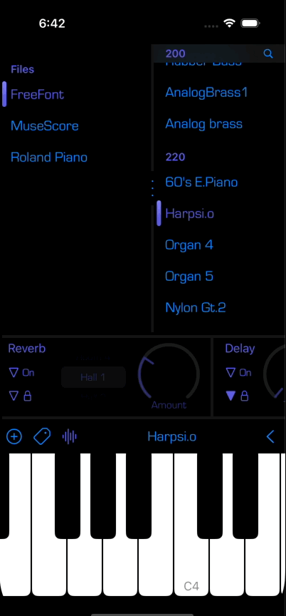

[![CI][status]][ci]
[![COV][cov]][ci]
[![License: MIT][mit]][license]

# SoundFonts+

This is the SwiftUI version of my [SoundFonts][0] app.

Main dependencies:

* [Composable Architecture (TCA)][1] -- opinionated approach to structuring an iOS app as composable features that
  provide for well-structured, understandable, testable, event flows and data transformations to drive SwiftUI views.
* [sqlite-data][2] -- provides a shared-data capability by combining Point-Free's [Sharing][3] and
  [StructuredQueries][4] libraries with the robust [GRDB][5] toolkit for SQLite.
* [AUv3Controls][6] -- custom SwiftUI controls (a circular knob and a toggle) that supports easy integration with AUv3
  AUParameter entities (built using the [TCA][1] library as well)
* [SF2Lib][7] -- an audio synthesizer in C++23 and Objective-C++ that reads sound font (SF2) files. It is used here to read the
  files and provide the presets info and meta data that goes into the SQLite tables.
* [brh-splitview][9] -- custom TCA-based SwiftUI view/feature that adjusts the width or height between two children.

# Status

The app now uses the AUv3 app extension for audio rendering, something which the original [SoundFonts][0] never did.
The app is getting close to feature-parity with the the original UIKit version:

* generates audio using both onscreen keyboard as well as from MIDI devices (MIDI support from my [MorkAndMIDI](https://github.com/bradhowes/morkandmidi) library)
* reverb and delay effects
* imports SF2 files
* supports cloning of presets (aka "favorites")
* tagging fonts

Nearly all app data resides in SQLite database, though there are some `UserDefaults` settings and a file-based `@Shared`
struct that holds:

* active SoundFont ID
* active preset ID
* active tag ID

These values are saved when changed and restored at app launch. An additional value (the selected SoundFont ID) is
shared as well but it is not restore.

When any of these values change, the various views update as would be expected:

* active tag ID changes --> list of SoundFont entries adapts
* selected SoundFont ID changes --> list of preset entries updates
* active preset ID changes:
    * audio effects update if preset has custom config
    * keyboard shifts to a configured value
    * SF2 engine loads preset (TBD)
    * MIDI mapping updated if preset has custom config (TBD)

The app also relies on in-memory `@Shared` values to simplify the logic and API.

## Keyboard

The keyboard is one SwiftUI view that leverages the latest SwiftUI features to be able to draw the keys and track
multiple touches that the same time. It too is a [TCA][1] feature but for performance reasons, the amount of info kept
in the state is minimal. The keyboad can be set to remain in place during a drag, or to slide as a touch moves. This all
replicates what currently exists in the original [SoundFonts][0] UIKit version. 

## Effects Controls

The original [SoundFonts][0] app provides a UI for two effects -- reverb and delay -- provided by Apple on all iOS devices.
This has been replicated in SwiftUI using my [AUv3Controls][6] package. The controls are also built using [TCA][1]
with the knob control using a debounce effect to reduce the amount of updates sent through its reducer.

## Dividers

There is a vertical divider between the list of sound font files and the list of presets, and a horizontal divider
separating the font list and the tags (usually hidden until the "tags" button is tapped in the info bar). These dividers
are custom SwiftUI views that adorn a custom view from the [brh-splitview][9] package that manages the width/height of
its children. Double-tapping on the horizontal divider will close the tags view.

## List Views

There are three SwiftUI list views on the home view:

* list of sound font names
* list of tags
* list of presets

The list of sound fonts depends on what tag is currently active in the tags list and whether a soundfont is a member of
the tag. Likewise, selecting a soundfont in the soundfont list will affect the contents of the presets list. However,
there are two types of soundfont selections: the `active` selection which reflects what is loaded in the synthesizer,
and a `selected` one that allows for view the presets of another soundfont without having to activate in the
synthesizer. The two types are represented by different text styles and indicators in the soundfonts list.

Originally, these selections used a `@Shared` property to communicate what tag, soundfont, and preset was active, but
unfortunately, the `@Shared` property does not work well in an AUv3 view context. For instance, if GarageBand loads two
or more SoundFontPlusAU components, they all share the same SwiftUI context, including all `@TaskLocal` properties such
as those used to manage `@Shared` state. Thus changing a list selection in one SoundFontPlusAU would cause the same
change to happen in the other SoundFontPlusAU component views as well. Now, all selections are shared by use of delegate
actions emitted by the list feature and seen by the AppRoot / AUv3Root feature, where the root feature then does the
proper `reduce(into:` call to forward an action to the others. This is a bit tedious, but testing easily captures the
correct operation and flags any failures.

### Presets List

The list of presets is the most complicated view due to the fact that various settings and actions affect what is shown:

- preset entries usually live in numbered sections
- presets can be searched on their names
- preset visibility can be toggled on/off
- presets can be ordered by numeric index or by name
- favorites (customized copies of presets) can appear inline next to their parent or at the top of the list

However, even with all of this complication, the code is fairly straight-forward the use of structures SQL queries that
adapt to the view settings, and due to the structured flow of actions and state transformations found in the TCA design.

# Code

The project contains two targets: the application (SoundFontsPlus) and an AUv3 app extension (SoundFontsPlusAU). The
latter is built and embedded in the former, and the app is the distribution vehicle for the app extension. There is very
little code to be found in the source folders for these two targets. Instead, the vast majority of the code resides as
"features" and libraries in the [Features/Sources](Features/Sources) folder. Each one is its own library that is managed
by Swift Package Manager (SPM) and built according to the [Package.swift](Features/Package.swift) file. Currently, the
list of libraries are:

- [AppReview][AppReview] -- feature that asks the user for a review at appropriate intervals
- [AppRoot][AppRoot] -- the top-level feature for the SoundFontsPlus app
- [AUv3Root][AUv3Root] -- the top-level feature for the SoundFontsAU AUv3 app extension. Currently (and unfortunately)
  this and [AppRoot][AppRoot] do not share common code to make sure that they handle actions the same way
- [BaseSupport][BaseSupport] -- common bits used by many of the other libraries
- [Changes][Changes.swift] -- feature that presents the app's markdown change log in a nice representation
- [DelayEffect][DelayEffect] -- feature for the controls of the delay effect available in the app
- [FeaturesSupport][FeatureSupport] -- common bits used by many of the features
- [FileImporter][FileImporter] -- feature that handles importing/adding SF2 files
- [Keyboard][Keyboard] -- feature that renders a piano keyboard at the bottom of the app. Supports multiple touches, and
  keyboard can scroll with the touch movements if enabled
- [MIDIConnections][MIDIConnections] -- manages a view of available external MIDI devices and some state information that
  is remembered between launches
- [MIDITrafficIndicator][MIDITrafficIndicator] -- small feature that just listens in on MIDI traffic and drives a bit
  SwiftUI when it sees some
- [Models][Models] -- collection of table definitions that make up the DB schema used by the app
- [Presets][Presets] -- collection of features that handle all of the actions associated with a soundfont preset. 
  - [PresetButton][PresetButton] -- even the button of the presets list are managed as a feature
  - [PresetEditor][PresetEditor] -- editor of preset meta data
  - [PresetsList][PresetsList] -- the feature for the list of "sections" of presets
  - [PresetsListSection][PresetsListSection] -- a feature for a group of presets that
    fall under a certain list heading. The hierarchy is `PresetsList -> [PresetsListSection] -> [PresetButton]`
- [ReverbEffect][ReverbEffect] -- feature for the controls of the reverb effect available in the app
- [SF2LibAU][SF2LibAU] -- the underlying AUv3 synth being used for audio generation
- [SF2Resources][SF2Resources] -- holds the four embedded SF2 files that come with the app
- [Settings][Settings] -- feature that presents the various settings that the user can change
- [SoundFonts][SoundFonts] -- collection of features that handle all of the actions associated with a soundfont
  - [SoundFontButton][SoundFontButton] -- the button of the sound font list (yes, a feature too)
  - [SoundFontEditor][SoundFontEditor] -- editor of soundfont meta data and tags
  - [SoundFontsList][SoundFontsList] -- the feature for the list of soundfonts
- [Synth][Synth] -- feature that manages the creation of the [SF2LibAU][SF2LibAU] AUv3 component used by the app for
  audio synthesis. Handles preset and soundfont changes by sending MIDI SysEx messages to the AUv3 component.
- [Tags][Tags] -- collection of features that deal with tags associated with soundfonts. Tag selection affects what
  soundfonts are shown in the soundfonts list view.
  - [TagButton][TagButton] -- the button for a tag in the tags list
  - [TagNameEditor][TagNameEditor] -- an editor for the name of a user tag
  - [TagsEditor][TagsEditor] -- an editor for the list of tags. Shown in two different situations, either by
  long-touching on a tag in the tags list, or from within the [SoundFontEditor][SoundFontEditor] where tag membership
  can be modified.
  - [TagsList][TagsList] -- feature showing the list of tags. Selecting a tag will constrain the list of soundfonts to
  only those which are associated with the selected tag.
- [TestSupport][TestSupport] -- collection of utilities for use in tests
- [Tuning][Tuning] -- feature that handles custom tuning settings. Appears in the [Settings][Settings] view for global
  tuning editing and in the [PresetEditor][PresetEditor] for custom tuning settings of a preset.
- [Tutorial][Tutorial] -- feature that shows a short tutorial about the app in paginated form. The tutorial is always
  shown when the app launches for the first time on a device. It can also reappear by means of a button in the
  [Settings][Settings] view.
- [VolumeMonitor][VolumeMonitor] -- feature that tracks the current volume setting of the device and the active preset
  setting. If the volume is zero and/or there is no active preset, notifies the AppRoot to inform the user about the
  lack of audio output.

Many of the features are used as-is for both the AUv3 and app targets. The AUv3 component has fewer features due to the
inherent limitations of being an app extension. Shared features that must adapt to being in an AUv3 component use the
`@Shared(.isAUv3)` attribute to omit functionality or drop SwiftUI elements.

Each library above has a corresponding collection of tests found in the [Features/Tests](Features/Tests) folder. Some of
the tests use Point*Free's [swift-snapshot-testing][10] library to
save renderings of a view in order to flag if something is done to mess up and inadvertently change how a feature's view
renders. Note that these tests are also performed on Github in the CI workflow, but currently test failures are not
flagged.

# History

The original [SoundFonts][0] app is written in Swift and UIKit. The data store is a disk file and a collection of
UserDefaults keys/value pairs, though there was a brief attempt at moving to CoreData for this storage.
This repo is my attempt to replace the original with SwiftUI and SQLite.

Originally it was based on SwiftData, but I encountered too many issues and hurdles. Another repo of mine
[SwiftDataTCA][8] contains some of my experiments in this area.

[0]: https://github.com/bradhowes/SoundFonts
[1]: https://github.com/pointfreeco/swift-composable-architecture
[2]: https://github.com/pointfreeco/sqlite-data
[3]: https://github.com/pointfreeco/swift-sharing
[4]: https://github.com/pointfreeco/swift-structured-queries
[5]: https://github.com/groue/GRDB.swift
[6]: https://github.com/bradhowes/AUv3Controls
[7]: https://github.com/bradhowes/SF2Lib
[8]: https://github.com/bradhowes/SwiftDataTCA
[9]: https://github.com/bradhowes/brh-splitview
[10]: https://github.com/pointfreeco/swift-snapshot-testing

[AppReview]: Features/Sources/AppReview/AppReview.swift
[AppRoot]: Features/Sources/AppRoot
[AUv3Root]: Features/Sources/AUv3Root
[BaseSupport]: Features/Sources/BaseSupport
[Changes]: Features/Sources/Changes/Changes.swift
[DelayEffect]: Features/Sources/DelayEffect/DelayEffect.swift
[FeaturesSupport]: Features/Sources/FeatureSupport
[FileImporter]: Features/Sources/FileImporter
[Keyboard]: Features/Sources/Keyboard/Keyboard.swift
[MIDIConnections]: Features/Sources/MIDIConnections/MIDIConnections.swift
[MIDITrafficIndicator]: Features/Sources/MIDITrafficIndicator/MIDITrafficIndicator.swift
[Models]: Features/Sources/Models
[Presets]: Features/Sources/Presets
[PresetButton]: Features/Sources/Presets/PresetButton.swift
[PresetEditor]: Features/Sources/Presets/PresetEditor.swift
[PresetsList]: Features/Sources/Presets/PresetsList.swift
[PresetsListSection]: Features/Sources/Presets/PresetsListSection.swift
[ReverbEffect]: Features/Sources/ReverbEffect/ReverbEffect.swift
[SF2LibAU]: Features/Sources/SF2LibAU
[SF2Resources]: Features/Sources/SF2Resources
[Settings]: Features/Sources/Settings/Settings.swift
[SoundFonts]: Features/Sources/SoundFonts
[SoundFontButton]: Features/Sources/SoundFonts/SoundFontButton.swift
[SoundFontEditor]: Features/Sources/SoundFonts/SoundFontEditor.swift
[SoundFontsList]: Features/Sources/SoundFonts/SoundFontsList.swift
[Synth]: Features/Sources/Synth/Synth.swift
[Tags]: Features/Sources/Tags
[TagButton]: Features/Sources/Tags/TagButton.swift
[TagNameEditor]: Features/Sources/Tags/TagNameEditor.swift
[TagsEditor]: Features/Sources/Tags/TagsEditor.swift
[TagsList]: Features/Sources/Tags/TagsList.swift
[TestSupport]: Features/Sources/TestSupport
[Tuning]: Features/Sources/Tuning
[Tutorial]: Features/Sources/Tutorial/Tutorial.swift
[VolumeMonitor]: Features/Sources/VolumeMonitor/VolumeMonitor.swift

[tags]: https://github.com/bradhowes/SoundFontsPlus/blob/main/Features/Sources/Tags/TagsList.swift#L177

[activeTagId]: https://github.com/bradhowes/SoundFontsPlus/blob/b5e786688593cf8ac2f6ab10a7ff1e1cdede9a5d/Features/Sources/Models/Support/ActiveState.swift#L10
[monitoring]: https://github.com/bradhowes/SoundFontsPlus/blob/b5e786688593cf8ac2f6ab10a7ff1e1cdede9a5d/Features/Sources/SoundFonts/SoundFontsList.swift#L103
[selectedSoundFontId]: https://github.com/bradhowes/SoundFontsPlus/blob/b5e786688593cf8ac2f6ab10a7ff1e1cdede9a5d/Features/Sources/Presets/PresetsList.swift#L266

[ci]: https://github.com/bradhowes/SoundFontsPlus/actions/workflows/CI.yml
[status]: https://github.com/bradhowes/SoundFontsPlus/actions/workflows/CI.yml/badge.svg
[cov]: https://img.shields.io/endpoint?url=https://gist.githubusercontent.com/bradhowes/3489d8974ae6894967b2a43f657f9d70/raw/SoundFontsPlus-coverage.json
[mit]: https://img.shields.io/badge/License-MIT-A31F34.svg
[license]: https://opensource.org/licenses/MIT
